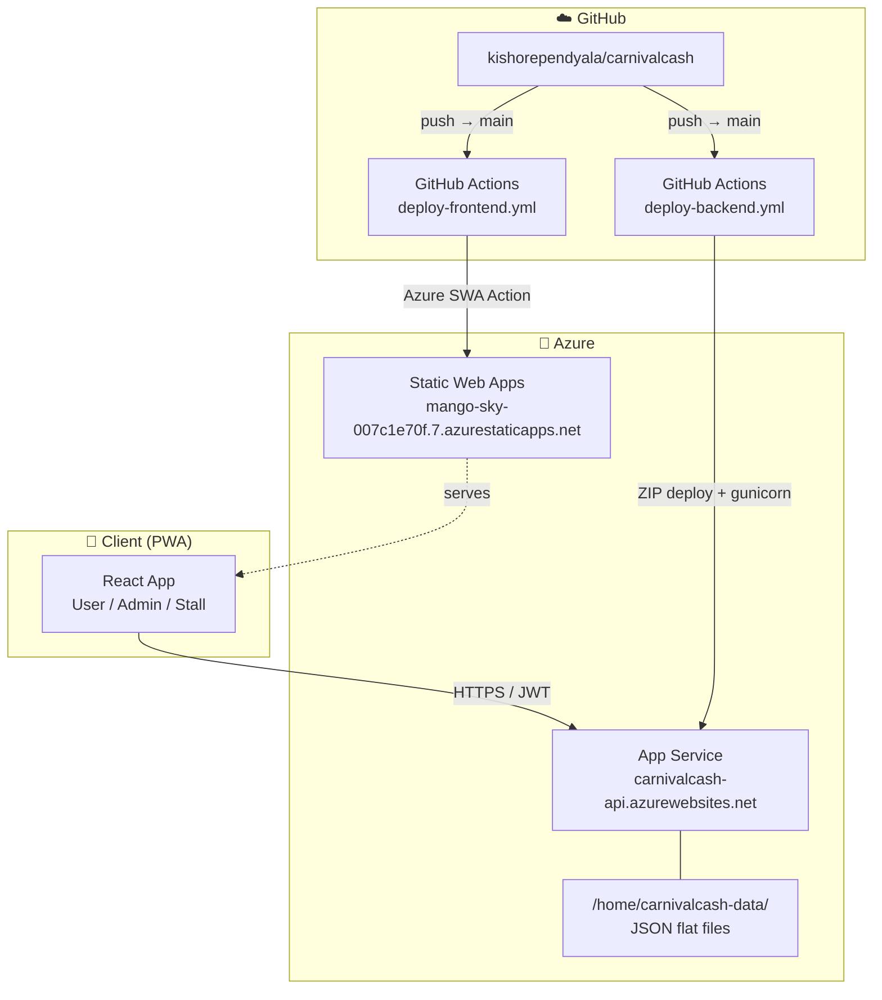

# 🎡 CarnivalCash

**Digital token bank for carnival & donation events** — scan QR codes to pay stalls, manage kids' wallets, track everything in real time.

> **PWA** — installable on iOS & Android. Works offline for viewing; requires connectivity for transactions.

---

## 🏗️ Architecture



### Data Layout

```
/home/carnivalcash-data/       ← Azure persistent storage (DATA_DIR)
├── profiles/<userId>.json     ← user/admin/stall-owner profiles
├── users/<userId>/
│   └── transactions.json
├── stalls/
│   ├── <yyyyMMdd_stall_XXXX>.json  ← stall entity (members, items, balance)
│   └── transactions/<stallId>.json
├── kids/<userId>/kids.json
└── admin.json                 ← token rate, audit log
```

### Token Flow

```
Admin ──add tokens──▶ User wallet
User  ──scan QR──────▶ picks items ──▶ tokens → Stall balance
Vendor/Stall member ──scan user QR──▶ charge  ──▶ same transfer
Kid QR ─────────────▶ deducted from parent's wallet
```

---

## 🚀 Deployment

### Local → Azure (end-to-end)

| Step                  | What happens                                                 |
| --------------------- | ------------------------------------------------------------ |
| `git push` to `main`  | GitHub Actions triggers automatically                        |
| `backend/**` changed  | `deploy-backend.yml` → pip install → ZIP → Azure App Service |
| `frontend/**` changed | `deploy-frontend.yml` → npm build → Azure Static Web Apps    |

```
[local dev]
    │  git push origin main
    ▼
[GitHub: kishorependyala/carnivalcash]
    │
    ├─▶ deploy-backend.yml ──────────────────────────────▶ carnivalcash-api.azurewebsites.net
    │       Python 3.11 · pip install · zip deploy
    │       startup: gunicorn --bind 0.0.0.0:8000 run:app
    │
    └─▶ deploy-frontend.yml ─────────────────────────────▶ mango-sky-007c1e70f.7.azurestaticapps.net
            Node 20 · CI=true npm build
            REACT_APP_API_BASE_URL → carnivalcash-api.azurewebsites.net
```

> ⚠️ `CI=true` in the frontend build treats ESLint warnings as **errors**. Fix all lint issues locally before pushing.

### Required GitHub Secrets

| Secret                            | Used by               |
| --------------------------------- | --------------------- |
| `AZURE_CLIENT_ID`                 | Backend deploy (OIDC) |
| `AZURE_TENANT_ID`                 | Backend deploy (OIDC) |
| `AZURE_SUBSCRIPTION_ID`           | Backend deploy (OIDC) |
| `AZURE_STATIC_WEB_APPS_API_TOKEN` | Frontend deploy       |

---

## 💻 Local Development

### Backend

```bash
cd backend
python -m venv venv && source venv/bin/activate
pip install -r requirements.txt
DATA_DIR=../data python run.py          # http://localhost:5000
```

### Frontend

```bash
cd frontend
npm install
REACT_APP_API_BASE_URL=http://localhost:5000 npm start   # http://localhost:3000
```

### Tests

```bash
cd backend && source venv/bin/activate
python -m pytest tests/ -q
```

### Environments

|              | Local                         | Azure                                          |
| ------------ | ----------------------------- | ---------------------------------------------- |
| **Frontend** | `localhost:3000`              | `mango-sky-007c1e70f.7.azurestaticapps.net`    |
| **Backend**  | `localhost:5000`              | `carnivalcash-api.azurewebsites.net`           |
| **Data**     | `./data/` (local clone)       | `/home/carnivalcash-data/` (persistent volume) |
| **Deploy**   | `python run.py` + `npm start` | GitHub Actions on push to `main`               |

---

## 👥 Contributors

- Harshan Kamesh
- Kishore Pendyala

---

## 📋 Changelog

### 2026-06-01

- **fix:** Re-validate JWT on app foreground (`visibilitychange`) — prevents stale logged-in UI on iOS after reopening the app from background
- **fix:** Pre-flight token expiry check in axios interceptor — expired tokens are caught before any network call fires
- **fix:** QR code printing now uses a body-level DOM portal (same pattern as admin print overlays) — fixes blank/clipped prints caused by `overflow-x: hidden` on the root element
- **fix:** `@media print` reset for `overflow` and SVG `max-width` — prevents the iOS overflow fix from clipping QR codes in print dialogs

### 2026-05-31

- **feat:** Responsive CSS class system — 4-tier breakpoints (320 px / 390 px / 640 px / 1024 px) via `.cc-*` utility classes
- **fix:** iOS horizontal overflow — `overflow-x: hidden` on `html`/`body`, `viewport-fit=cover` meta tag, `box-sizing: border-box` globally
